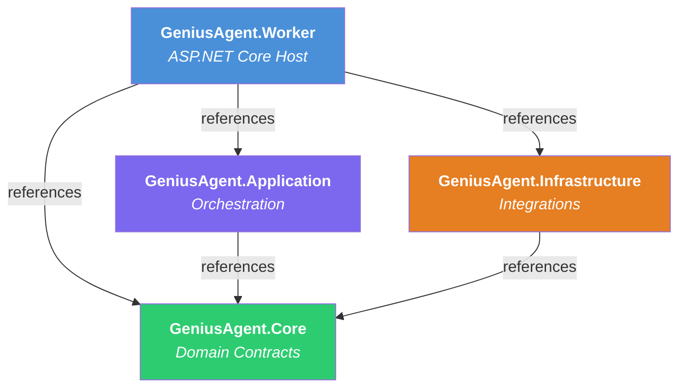
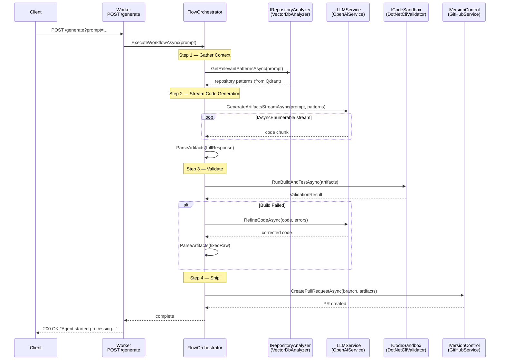
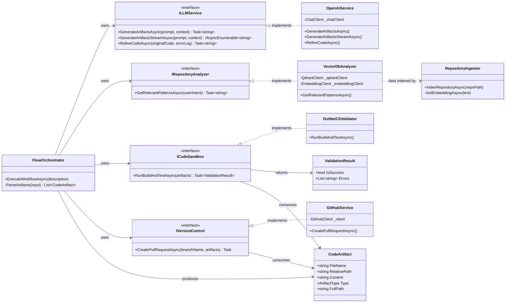
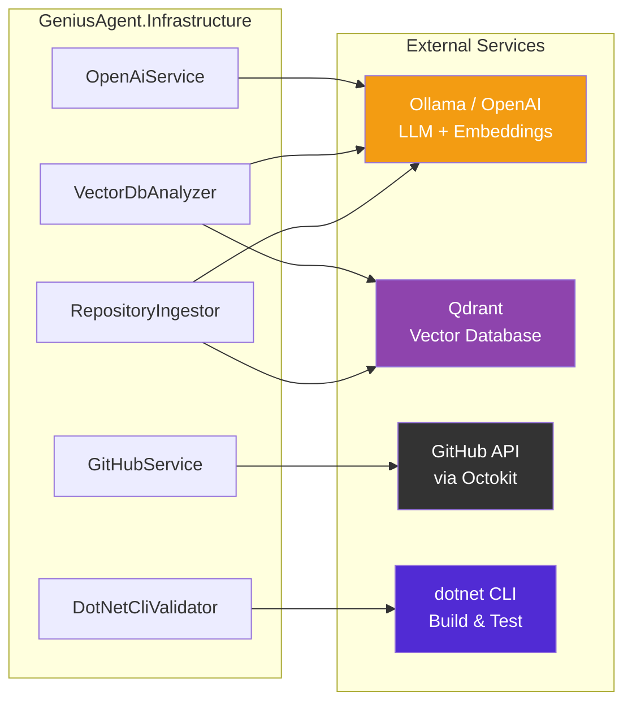

# GeniusAgent — Architecture Diagram

> AI-powered code generation agent built on .NET 10 with Clean Architecture.

---

## Solution Structure

```
GeniusAgent.sln
├── GeniusAgent.Worker          # ASP.NET Core host – HTTP API entry point
├── GeniusAgent.Application     # Orchestration / use-case layer
├── GeniusAgent.Core            # Domain models & interface contracts
└── GeniusAgent.Infrastructure  # External service integrations
```

---

## Layer Dependency Graph



---

## Request Workflow



---

## Component Detail



---

## Infrastructure Integrations



---

## DI Registration (Program.cs)

| Interface | Implementation | Lifetime |
|---|---|---|
| `ILLMService` | `OpenAiService` | Singleton |
| `IRepositoryAnalyzer` | `VectorDbAnalyzer` | Singleton |
| `ICodeSandbox` | `DotNetCliValidator` | Singleton |
| `IVersionControl` | `GitHubService` | Singleton |
| `FlowOrchestrator` | *(self)* | Scoped |

---

## Key NuGet Packages

| Package | Used By | Purpose |
|---|---|---|
| `Azure.AI.OpenAI` | Infrastructure | OpenAI-compatible chat & embedding client (Ollama) |
| `Qdrant.Client` | Infrastructure | Vector similarity search |
| `Octokit` | Infrastructure | GitHub REST API (branches, commits, PRs) |
| `Microsoft.SemanticKernel` | Application / Worker | AI orchestration primitives |
| `Hangfire.AspNetCore` | Worker | Background job scheduling |
| `Microsoft.AspNetCore.OpenApi` | Worker | OpenAPI metadata |
