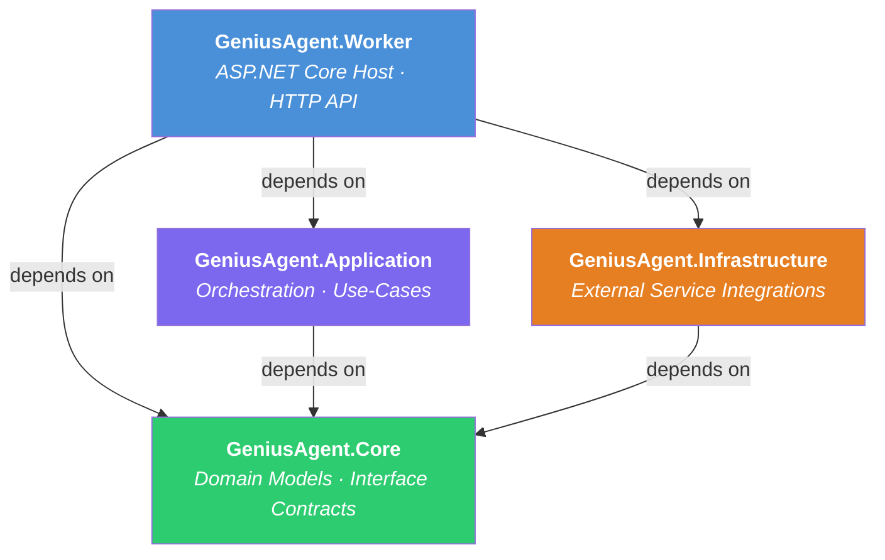
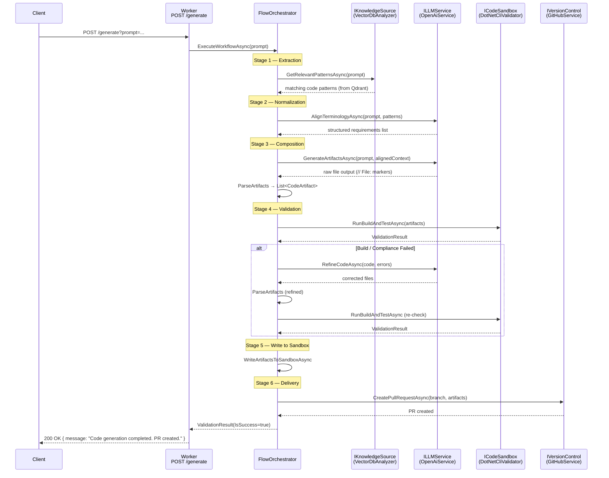
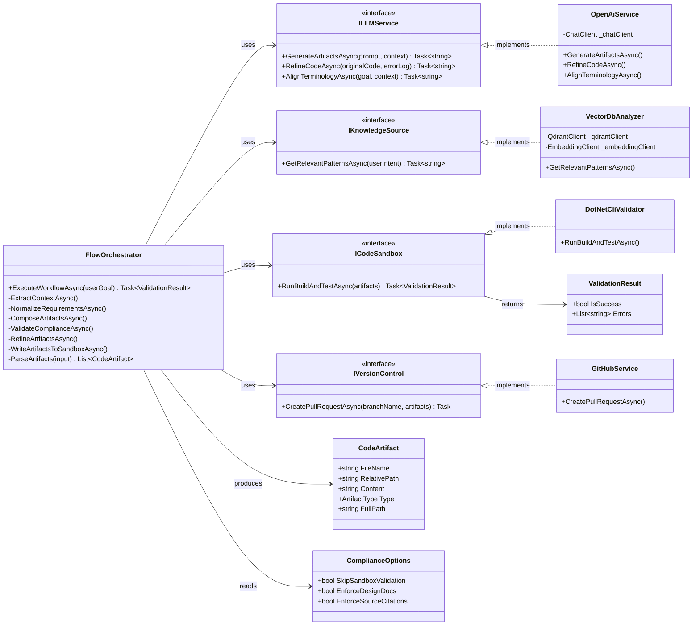
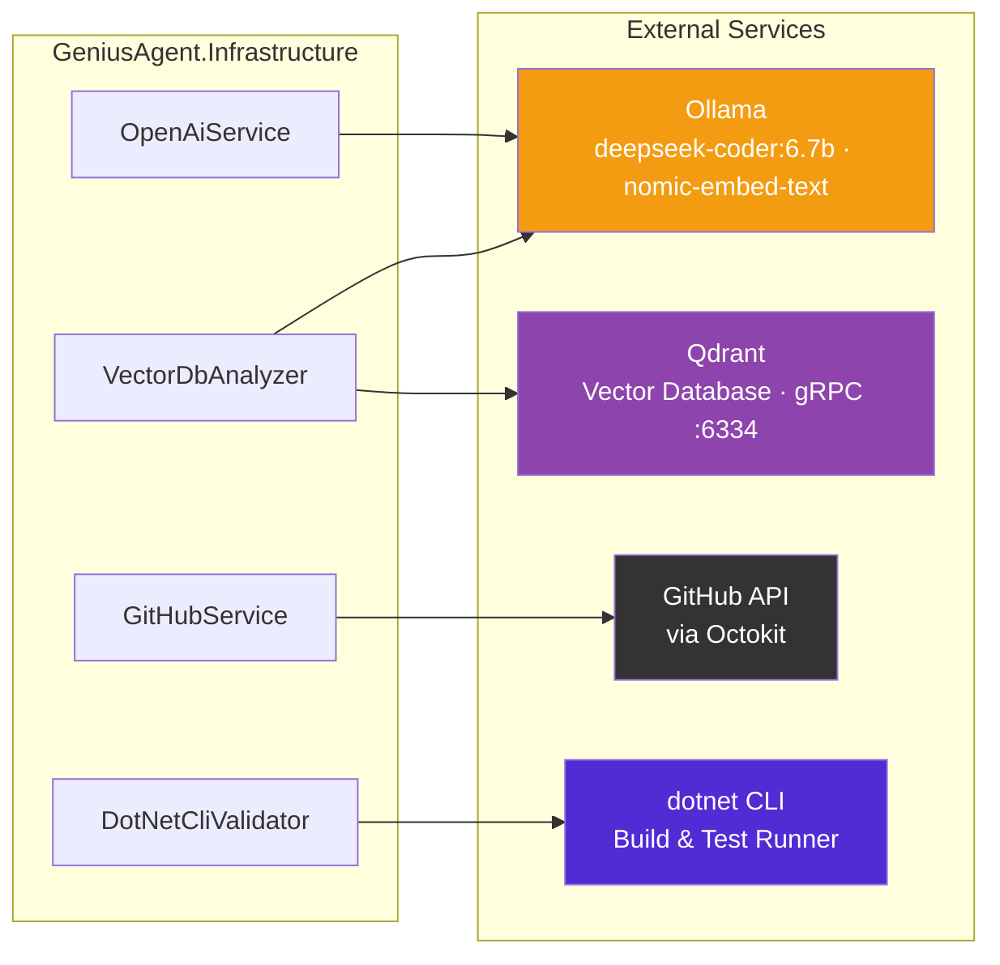

# GeniusAgent

> An AI-powered .NET 10 code-generation agent built on Clean Architecture. Given a plain-English prompt, GeniusAgent retrieves relevant patterns from your codebase, generates complete, compilable .NET source files, validates them in a sandbox, and opens a pull request — all autonomously.

---

## Table of Contents

1. [Architecture Overview](#architecture-overview)
2. [Project Structure](#project-structure)
3. [Application Flow](#application-flow)
4. [Component Detail](#component-detail)
5. [Infrastructure Integrations](#infrastructure-integrations)
6. [Configuration](#configuration)
7. [Getting Started](#getting-started)
8. [API Reference](#api-reference)

---

## Architecture Overview

GeniusAgent follows Clean Architecture with four layers. Dependencies always point inward — outer layers depend on inner layers, never the reverse.



---

## Project Structure

```
GeniusAgent.slnx
├── GeniusAgent.Worker/               # ASP.NET Core host — HTTP entry point
│   ├── Program.cs                    # DI registration, minimal-API endpoint
│   ├── appsettings.json              # Runtime configuration
│   └── Properties/launchSettings.json
│
├── GeniusAgent.Application/          # Orchestration / use-case layer
│   └── FlowOrchestrator.cs           # 6-stage agentic workflow
│
├── GeniusAgent.Core/                 # Pure domain — no framework dependencies
│   ├── Interfaces/
│   │   └── IAgentServices.cs         # ILLMService, IKnowledgeSource, ICodeSandbox, IVersionControl
│   └── Models/
│       └── CodeArtifact.cs           # CodeArtifact, ValidationResult, ComplianceOptions
│
├── GeniusAgent.Infrastructure/       # Concrete integrations
│   └── Services/
│       ├── OpenAiService.cs          # Ollama-compatible LLM client (ILLMService)
│       ├── VectorDbAnalyzer.cs       # Qdrant vector search (IKnowledgeSource)
│       ├── DotNetCliValidator.cs     # dotnet test sandbox (ICodeSandbox)
│       └── GitHubService.cs          # GitHub PR creation via Octokit (IVersionControl)
│
├── GeniusAgent.Application.Tests/    # xUnit unit tests
├── docker-compose.yml                # Qdrant + Ollama local services
└── ARCHITECTURE.md                   # Detailed Mermaid diagrams
```

---

## Application Flow

A single `POST /generate` call triggers a six-stage agentic pipeline inside `FlowOrchestrator`:



### Stage Summary

| # | Stage | What happens |
|---|-------|-------------|
| 1 | **Extraction** | Embed the prompt and retrieve the top-5 semantically similar code chunks from Qdrant |
| 2 | **Normalization** | Ask the LLM to rewrite the goal as a structured requirements list for consistency |
| 3 | **Composition** | Generate complete `.cs` and `.md` artifacts; parse the `// File:` delimited response |
| 4 | **Validation** | Run `dotnet test` in an isolated sandbox project; enforce compliance rules |
| 5 | **Write** | Persist artifacts to `SandboxProject/` on disk |
| 6 | **Delivery** | Open a GitHub pull request on a generated `ai/feat-*` branch |

---

## Component Detail



---

## Infrastructure Integrations



### DI Registration

| Interface | Implementation | Lifetime |
|-----------|---------------|----------|
| `ILLMService` | `OpenAiService` | Singleton |
| `IKnowledgeSource` | `VectorDbAnalyzer` | Singleton |
| `ICodeSandbox` | `DotNetCliValidator` | Singleton |
| `IVersionControl` | `GitHubService` | Singleton |
| `FlowOrchestrator` | *(self)* | Scoped |

### Key NuGet Packages

| Package | Layer | Purpose |
|---------|-------|---------|
| `Azure.AI.OpenAI` | Infrastructure | OpenAI-compatible chat & embedding client |
| `Qdrant.Client` | Infrastructure | Vector similarity search |
| `Octokit` | Infrastructure | GitHub REST API (branches, commits, PRs) |
| `Scalar.AspNetCore` | Worker | Interactive OpenAPI UI |
| `xunit` | Tests | Unit testing framework |

---

## Configuration

All settings live in `GeniusAgent.Worker/appsettings.json`:

```jsonc
{
  "OpenAi": {
    "ApiKey": "ollama",                          // Ollama ignores the key value
    "Endpoint": "http://localhost:11434/v1",     // Ollama REST endpoint
    "Model": "deepseek-coder:6.7b",              // Code-generation model
    "EmbeddingModel": "nomic-embed-text"         // Embedding model for RAG
  },
  "VectorDb": {
    "Endpoint": "http://localhost:6334",         // Qdrant gRPC endpoint
    "CollectionName": "genius-agent-local-nomic" // Qdrant collection name
  },
  "Compliance": {
    "SkipSandboxValidation": false,   // Set true to skip dotnet test step
    "EnforceDesignDocs": true,        // Require a Design.md in every generation
    "EnforceSourceCitations": false   // Require // Source: comments in services
  }
}
```

---

## Getting Started

### Prerequisites

| Tool | Version | Purpose |
|------|---------|---------|
| [.NET SDK](https://dotnet.microsoft.com/download) | 10.0+ | Build & run the agent |
| [Docker](https://www.docker.com/) | any | Run Qdrant & Ollama locally |

### 1 — Start local services

```bash
docker compose up -d
```

This starts:
- **Qdrant** on `http://localhost:6333` (REST) and `localhost:6334` (gRPC)
- **Ollama** on `http://localhost:11434`

After Ollama starts, pull the required models:

```bash
docker exec -it <ollama-container> ollama pull deepseek-coder:6.7b
docker exec -it <ollama-container> ollama pull nomic-embed-text
```

### 2 — Clone & run

```bash
git clone https://github.com/naveen2698/GeniusAgent.git
cd GeniusAgent
dotnet run --project GeniusAgent.Worker
```

The API is available at `http://localhost:5000` (or the port shown in the console).

### 3 — Generate code

```bash
curl -X POST "http://localhost:5000/generate?prompt=Create+a+calculator+service+with+add+subtract+multiply+and+divide"
```

A successful response:

```json
{ "message": "Code generation completed. PR created." }
```

---

## API Reference

### `POST /generate`

Starts the AI code-generation workflow for the given prompt.

| Parameter | Location | Type | Required | Description |
|-----------|----------|------|----------|-------------|
| `prompt` | Query string | `string` | ✅ | Plain-English description of the code to generate |

#### Responses

| Status | Body | Meaning |
|--------|------|---------|
| `200 OK` | `{ "message": "Code generation completed. PR created." }` | Workflow succeeded; PR opened |
| `422 Unprocessable Entity` | `{ "message": "...", "errors": [...] }` | Generated code failed compliance checks after self-healing |
| `502 Bad Gateway` | `{ "detail": "..." }` | Unexpected internal error |

Interactive docs (Scalar UI) are available at `http://localhost:5000/scalar` when running in Development mode.